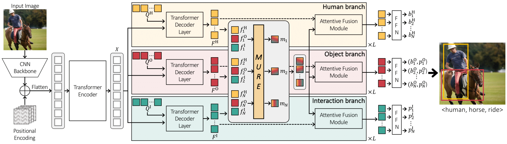

## [CVPR 2023] Relational Context Learning for Human-Object Interaction Detection
This repo is the official code for the CVPR 2023 paper "[Relational Context Learning for Human-Object Interaction Detection](https://arxiv.org/abs/2304.04997)".


## Installation
```shell
git clone https://github.com/OreoChocolate/MUREN.git
cd MUREN
conda create -f env.yaml 
```

## Data preparation
dataset files
[onedrive link](https://postechackr-my.sharepoint.com/:u:/g/personal/sosfd_postech_ac_kr/EU0FaAodTDROsdUi1kiOhC0B2Xt_kAbbcZf-twYg4o44fw?e=kFfKOd)

pretrained weights
[onedrive link](https://postechackr-my.sharepoint.com/:u:/g/personal/sosfd_postech_ac_kr/ETj2jNXgs_xOhcMWBJ7aghUB_g5c8jiozggmFcaxpyXFkg?e=kKaCJq)

After downloading the above files, unzip using the command below:

```
unzip data.zip
unzip pretrained.zip
```

The downloaded files should be placed as follows:
```
MUREN
├── data
│   ├── hico_20160224_det
│   └── v-coco
└── pretrained
```

## Training
#### HICO-DET

To train the model on HICO-DET dataset, run the following command:
```python
torchrun --rdzv_id 1234 --rdzv_backend=c10d --nproc_per_node=4 --rdzv_endpoint=localhost:6400 main.py \
        --pretrained pretrained/detr-r50-pre-2stage-nq64.pth \
        --output_dir PATH/TO/SAVE \
        --dataset_file hico --hoi_path data/hico_20160224_det \
        --num_obj_classes 80 --num_verb_classes 117 \
        --backbone resnet50 --num_queries 64 \
        --enc_layers 6 --dec_layers 6 \
        --epochs 100 --lr_drop 60 --num_worker 8 --batch_size 4
```
#### V-COCO
To train the model on V-COCO dataset, run the following command:

```python
torchrun --rdzv_id 1234 --rdzv_backend=c10d --nproc_per_node=4 --rdzv_endpoint=localhost:6400 main.py \ 
        --pretrained pretrained/detr-r50-pre-2stage-nq100.pth \
        --output_dir  PATH/TO/SAVE \
        --dataset_file vcoco --hoi_path data/v-coco \
        --num_obj_classes 81 --num_verb_classes 29 \
        --backbone resnet50 --num_queries 100 \
        --enc_layers 6 --dec_layers 6 \
        --epochs 100 --lr_drop 60 --num_worker 8 --batch_size 4 --freeze
```
## Evalutation
#### HICO-DET
```python
CUDA_VISIBLE_DEVICES=0 python main.py --pretrained "pretrained/hico-best.pth" \
  --dataset_file hico --hoi_path data/hico_20160224_det \
  --num_obj_classes 80 --num_verb_classes 117 --backbone resnet50 \
  --num_queries 64 --dec_layers 6 --num_workers 8 --batch_size 4 --use_nms_filter \
  --eval
```

If you want to evaluate on Known Object (KO) setting, add ```--ko``` flag.

#### V-COCO
```python
CUDA_VISIBLE_DEVICES=0 python generate_vcoco_official.py \
        --param_path "pretrained/vcoco-best.pth" \
        --save_path "data/v-coco/vcoco.pickle" \
        --hoi_path data/v-coco \
        --num_queries 100 --dec_layers 6 --batch_size 1 --backbone resnet50 --use_nms_filter

cd data/v-coco
python vsrl_eval.py "vcoco.pickle"
```

## Citation
If you find this code helpful for your research, please cite our paper.
```
@article{kim2023relational,
  title={Relational Context Learning for Human-Object Interaction Detection},
  author={Kim, Sanghyun and Jung, Deunsol and Cho, Minsu},
  journal={arXiv preprint arXiv:2304.04997},
  year={2023}
}
```

## Acknowledge
This repo is based on [CDN](https://github.com/YueLiao/CDN). Thanks for their works.
